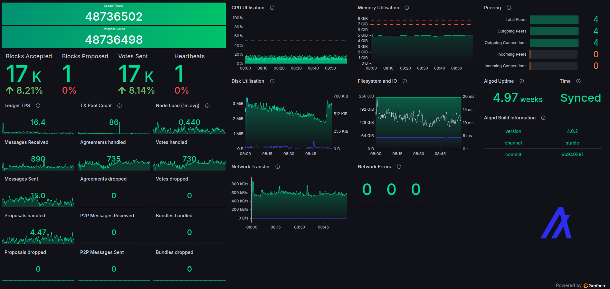

# Algorand - Grafana Community Dashboard

## Overview
This repository contains a Grafana dashboard template designed for graphing Algorand node metrics.
The dashboard provides real-time metrics and performance data visualisations for node operators.

[Live Demo](https://metrics.algorand.ing/public-dashboards/aea0dfee522a471c8ee4f9dbdf690574)

## Technical Details
The dashboard template utilises Prometheus as its data source, the Prometheus server needs to be setup to target port 9100 on the Algorand node and collect metrics from the `/metrics` endpoint.

## Prerequisites
- Grafana (v11.3.0+)
- Prometheus server configured to scrape metrics from your Algorand node
- Algorand node with metrics enabled

## Template Installation
1. Download or copy the JSON template from this repository
2. Import the template into your Grafana instance:
   - Navigate to Dashboards -> New -> Import
   - Upload the JSON file or paste its contents
   - Configure the Prometheus data source connection
   - Save the dashboard

## Configuration
The dashboard is designed to work with minimal configuration once the Algorand node and Prometheus server are setup.
